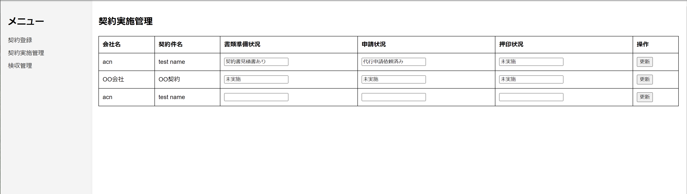

# ①課題番号-プロダクト名

契約管理サイト

## ②課題内容（どんな作品か）
- 契約の段階ごとに管理できるサイト
  - 契約案件登録
  - 契約準備
  - 検収（支払い）

## ③DEMO
- 以下画像をクリックすると動画で確認できます。
  - 
-  

## ④作ったアプリケーション用のIDまたはPasswordがある場合
なし
<!-- - ID：dev@challenge-project.com
- PW：zK2n*N_m -->

## ⑤工夫した点・こだわった点
- 企業で必要になりそうな体験を想像しながら作成物を決めたところ

## ⑥難しかった点・次回トライしたいこと(又は機能)
- 難しかった点
    - さくらのDBを使うのが初めてだったので移行に戸惑いました。
- 次回トライしたいこと
  - まだモックレベルなので機能充実させたい
    - 契約管理はそれぞれ期間が異なっていて、複数ある契約をExcelやフォルダ管理では綺麗に可視化するのが難しい、それをうまく可視化できるようにしたい。DBと相性が良さそう
    - 契約単位でフォルダ作ると、今月どの検収をしたら良いかがすぐわからない
    - 検収月単位でフォルダを作ると、案件追加の手間が増えつつその案件の検収状況をすぐにとってこれない

## ⑦質問・疑問・感想、シェアしたいこと等なんでも
- [感想]
  - ファイル処理やエスケープ処理が難しくて、phpを使うことで処理が一気に複雑になったように感じた。対策しきれなかったので脆弱なサイトを作ってしまった気がする。。
- [参考記事]# tech-php2
